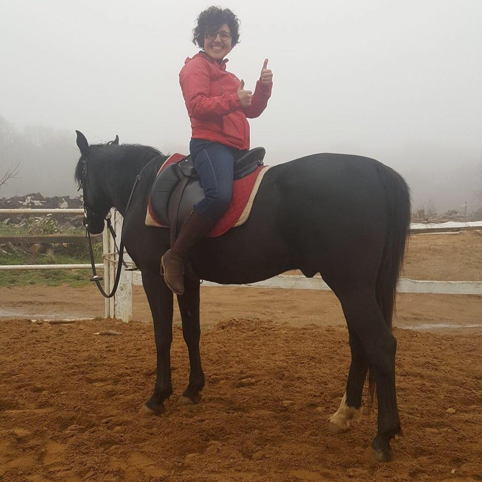

<style type="text/css">
.title {
  display: none;
}

#getting-started img {
  margin-right: 10px;
}

</style>

<div class="row" style="padding-top: 30px;">
<div class="col-sm-6">

# **About Me**

I am a current PhD student in Applied Economics and Management (AEM) at the [UNIBG](https://www.unibg.it/node/9405en/people/phd-students) & [UNIPV](https://sites.google.com/unipv.it/phd-aem/home-page/people/students) in Italy.
I like doing [applications](https://github.com/seymakalay), biking, cooking for family & friends, woodworking, and gardening the most.

## My Tutors

During my PhD, I have been thankful for each of my companions and professors whom I learn and improve a lot. 
Especially, I am personally thankful to the head of the department 
[Prof. Gianmaria Martini](https://didattica-rubrica.unibg.it/ugov/person/2189), 
and my supervisors 
[Prof. Michela Cameletti](https://didattica-rubrica.unibg.it/ugov/person/2441) and
[Prof. Federica Maria Orgio](https://didattica-rubrica.unibg.it/ugov/person/3333).

<!--\1  <a href="https://didattica-rubrica.unibg.it/ugov/person/3333" target="_blank">Prof. Federica Maria Orgio</a>. \1-->


## My Research Interest

Implementing Machine Learning to understand access to credit. And the name of the chapters of my dissertation as follows,

1. Determinants of Access to Finance: A Bibliometric Literature Review. 
2. Access to Credit: The Self-Employment Case in the Chinese Labor Market.
3. Predicting Financial Health of the Households Using Machine Learning Algorithms.

Check out my <a href="./Kalay_PHD_Presantation.pdf" target="_blank">Phd-Dissertation</a> presentation.


  
  
```{r load_packages, message=FALSE, warning=FALSE, include=FALSE} 
library(fontawesome)
```                     


---

This web page was built with [`r fa("r-project", fill = "steelblue")`](https://www.rstudio.com), 
hosted by [`r fa("github", fill = "purple")`](https://docs.github.com/en/github/working-with-github-pages/about-github-pages), and last compiled `r Sys.Date()`.


<!--\1 
This web page was built with [RStudio](https://www.rstudio.com), hosted by [Github](https://docs.github.com/en/github/working-with-github-pages/about-github-pages), and last compiled `r Sys.Date()`.
#### `r fa("github", fill = "steelblue")` H4 Heading      
[`r fa("r-project", fill = "steelblue")`](https://www.rstudio.com)
\1-->


<!--\1 
fork the repo for this website and follow instructions on read me to get set up. [https://github.com/CrumpLab/LabJournalWebsite](https://github.com/CrumpLab/LabJournalWebsite)
2. Blog/journal what you are doing in R, by editing the Journal.Rmd. See the [Journal page](https://crumplab.github.io/LabJournalWebsite/Journal.html) for an example of what to do to get started learning R.
3. See the [links page](https://crumplab.github.io/LabJournalWebsite/Links.html) for lots of helpful links on learning R.
\1-->


<!--\1   \1-->
</div>
<div class="col-sm-6">

<!--\1 
### [Crump Lab: Human Cognition and Performance](https://crumplab.github.io) 
<a href = "https://crumplab.github.io">
\1-->


<!--\1  ^[This web page was built with [RStudio](https://www.rstudio.com) and hosted by [github](https://docs.github.com/en/github/working-with-github-pages/about-github-pages).] </a> \1-->
</div>


 